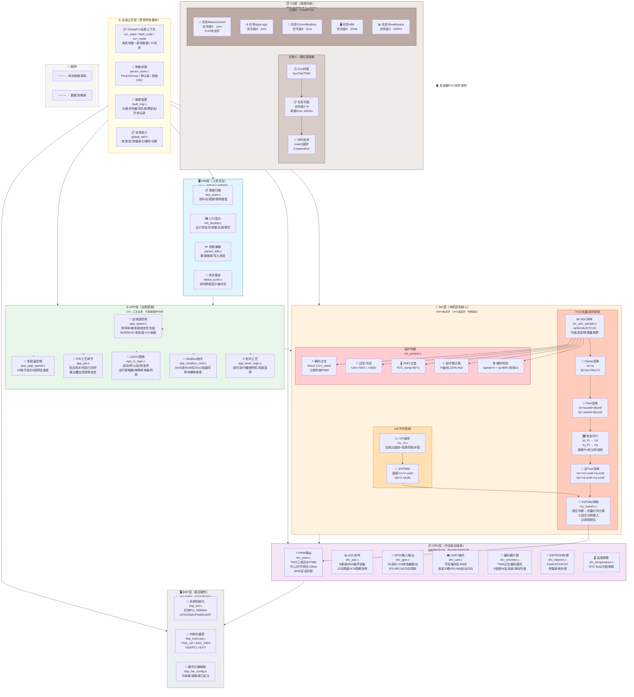

# 变频器FOC软件架构思维导图

> GitHub支持Mermaid渲染，直接打开此文件即可查看思维导图。



---

## 核心调用链路速览

```
启动流程:
main() 
  └─► BSP_Init()              // 硬件初始化
       └─► GlobalCtx_Init()   // 全局上下文
            └─► Param_Load()  // 参数加载
                 └─► 各层Init()函数
                      └─► Scheduler_Run()  // 永不返回

运行数据流:
  给定源(面板/Modbus/AI/多段速)
       │
       ▼
  APP_Speed_Task() ──► 频率斜坡
       │
       ▼
  MC_VF_Control()  或  MC_FOC_CurrentLoop()
       │
       ├──► SVPWM_Calc() ──► DRV_PWM_SetDuty() ──► TIM1输出
       │
       ▼
  MC_Protect_Check() ──► 故障? ──► DRV_PWM_Disable()
       │
       ▼
  APP_IO_Task() ──► DO输出/故障继电器
       │
       ▼
  HMI_DISP_Update() ──► LCD显示

中断时序:
  TIM1_UP (10kHz) ──► MC_FOC_CurrentLoop() ──► SVPWM
  TIM2 (1ms)      ──► MC_Protect_Check() + APP任务
  SysTick (1ms)   ──► Scheduler_TickISR()
```

---

## 六大核心模块速记

| 层级 | 模块 | 核心文件 | 调用频率 | 职责 |
|------|------|----------|----------|------|
| 🖥️ HMI | 按键显示 | hmi_key.c / hmi_display.c | 10ms | 人机交互入口 |
| ⚙️ APP | 速度/PID/IO | app_speed.c / app_pid.c / app_io_logic.c | 1ms | 工艺逻辑 |
| 🔥 MC | FOC/SVPWM | mc_foc.c / mc_svpwm.c / mc_vf.c | 10kHz | 电机算法核心 |
| 📦 DRV | PWM/ADC/UART | drv_pwm.c / drv_adc.c / drv_uart.c | 中断级 | 硬件抽象 |
| 🖥️ BSP | 初始化 | bsp_init.c / bsp_interrupt.c | 启动1次 | 寄存器配置 |
| ⏱️ OS | 调度器 | scheduler_bare.c | 1ms tick | 任务分时 |
